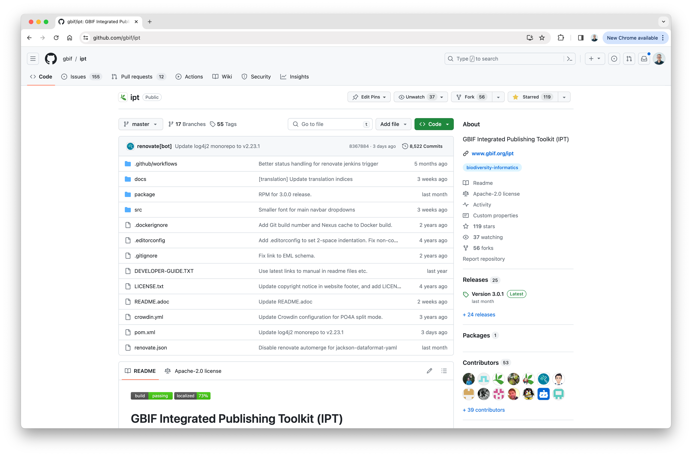
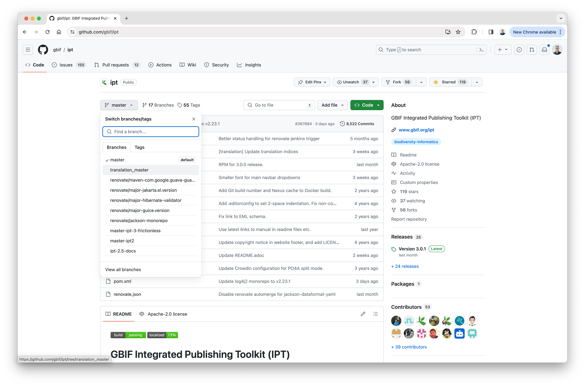
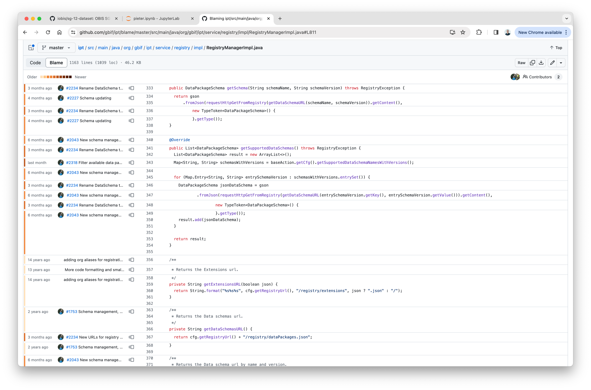
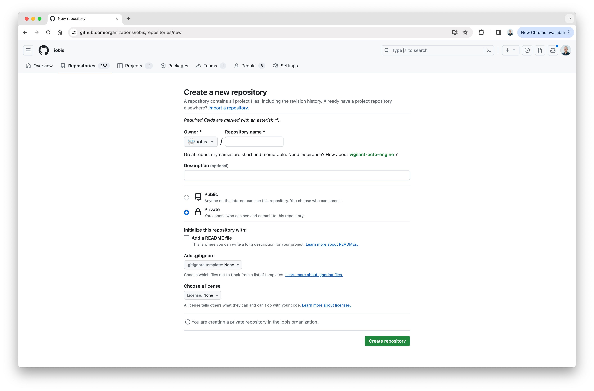
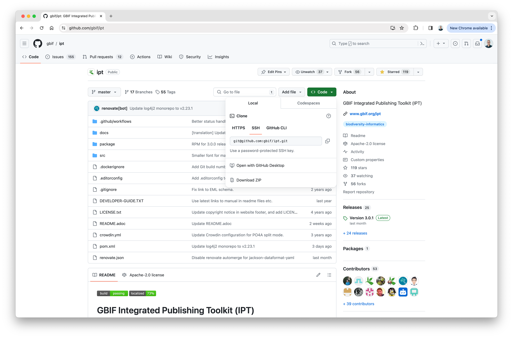
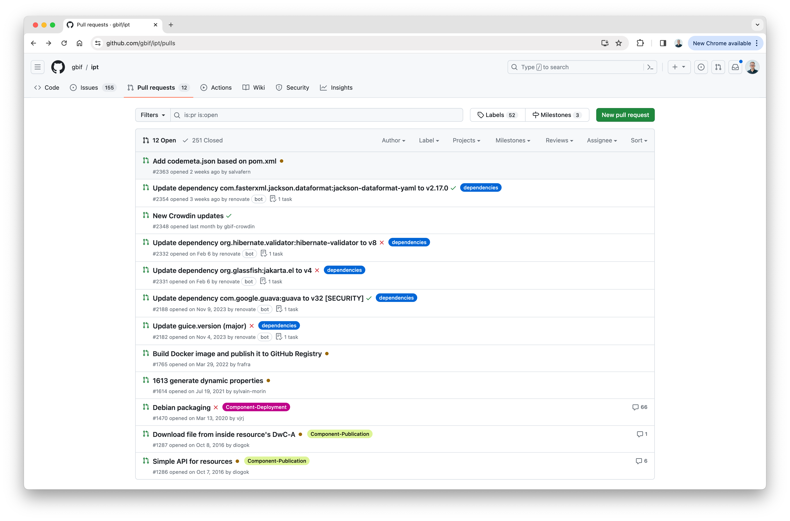
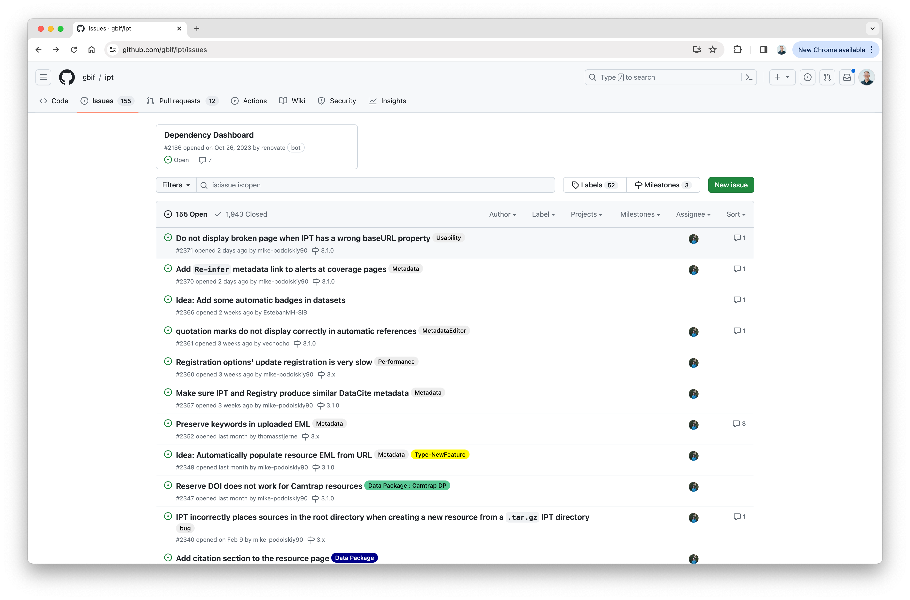
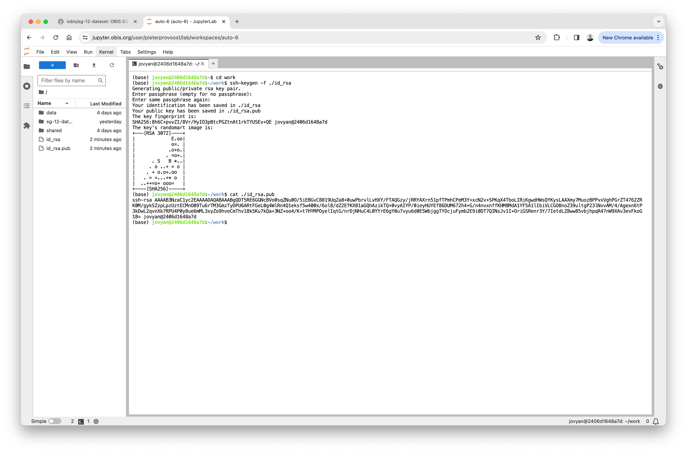
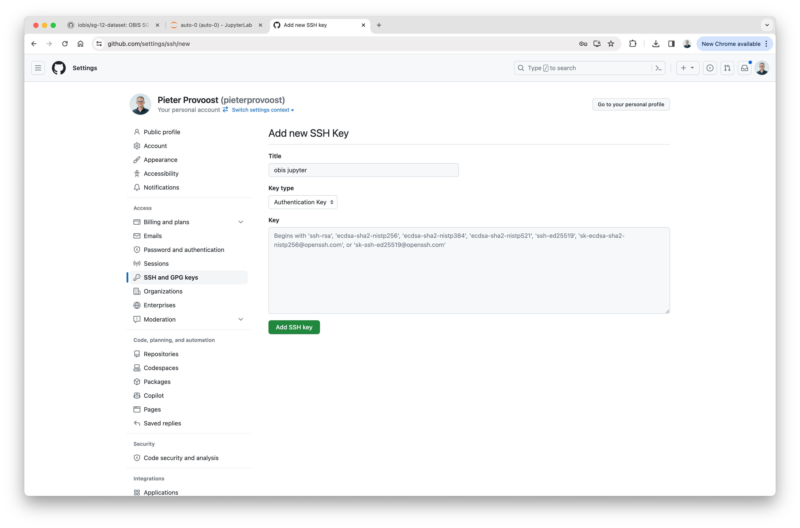

# Using GitHub

Before reading this section, familiarize yourself with [Using git](git.md).

## What is GitHub?

GitHub is a web-based platform for version control and collaboration. It is built on top of git, and it is the most popular platform for open source software development. GitHub is used to manage projects, host code and documentation, collaborate with other developers, track issues, and much more. GitHub has been part of Microsoft since 2018.

On GitHub, repositories are organized by users and organizations. For example, the IPT codebase is part of the GBIF organization and is hosted at <https://github.com/gbif/ipt>. Repositories can be public or private.



## Branches

To view all branches for a repository, click on the `Branch` button. Clicking a branch name will switch the view to that branch.



## Commits

To see all commits for a branch, click the `xx commits` link at the top right of the file listing. To view the version of the repository corresponding to a specific commit, click the `<>` icon.


When viewing code, you can see the commits that contributed each line of code by clicking the line number and selecting the `git blame` function.



## Creating a repository

To create a new repository, go to your organization or personal profile, and click the `New` button. Pick a repository name, select the Private or Pubic option, and click `Create repository`.

To initialize the repository with a README file, select the `Add a README file` option. If you do not select this option, instructions for linking your local repository to the remote repository will be provided.



## Cloning a repository

To clone a repository, click the `Code` button and copy the URL. Then open a terminal and run `git clone <URL>`. Alternatively, select `Download ZIP` to download the repository as a ZIP file.



## Forking a repository

When you fork a repository, a copy of the upstream repository is created in your own workspace. Typically you fork a repository to propose changes to the upstream repository, by creating commits in your fork and subsequently creating a pull request.


## Pull requests

A pull request is used to propose changes to an upstream repository. When you make changes in your fork or branch, GitHub will present the option to create a pull request. It's then up to the maintainers of the upstream repository to review and merge your changes. In some cases the maintainer will ask you to make changes before the pull request is accepted.




## Issues

GitHub also provides issues tracking. Issues can be used to report bugs, request features, or discuss ideas. Issues can be assigned to users, labeled, and linked to pull requests.



## Demo: contributing to the OBIS manual


## Authentication

To be able to pull and push code from and to GitHub from your local machine, you need to authenticate yourself with GitHub. To do this, you will need to generate an SSH key pair, and upload the public key to GitHub. If you are working on the OBIS JupyterHub, the key pair will not be preserved across sessions, so you will need to store it in your work folder and configure git to use it.

Run the following commands in a new terminal:

```bash
ssh-keygen -f ~/work/id_rsa
cat ~/work/id_rsa.pub
```

This will print the public key to the terminal. Copy the key, go to GitHub, and add it to your SSH keys in your account settings.





To configure git to use the key, run:

```bash
git config --local core.sshCommand "ssh -i ~/work/id_rsa"
```

Note that this only works when you are in an existing git directory. To use the new key to clone a repository, you can run:

```bash
GIT_SSH_COMMAND="ssh -i ~/work/id_rsa" git clone <repo-url>
```

Then in the repository directory, run the `git config` command above.
